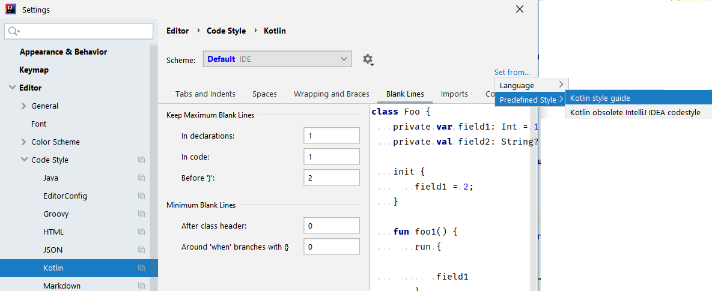

# Development


This document contains information for developers who want to contribute to the the project.

## How to compile the code

The project uses gradle and a gradle wrapper is included. That means that you can simply execute `./gradlew` (on Mac/Linux) or `gradlew.bat` (on Windows) to run it.

The project contains an ANTLR grammar from which a parser in Java is generated. To generate it run:

```
./gradlew generateGrammarSource
```

The code can then be compiled with:

```
./gradlew build
```

### IDEA 2020
Importing project from github should be enough.

### IDEA 2019
After cloning the project, run
```
./gradlew idea
```
Then run the tests:
```
./gradlew test
```
You are now ready to import the gradle project into IDEA. We suggest to flag the *"Automatically import this project on changes in build script files"* option in gradle settings.

[Here is a short video on how to setup a Linux workstation to develop this project with IDEA 2019](https://youtu.be/eByxIBsLMp4)

### IDEA 2018
Then import in IDEA 2018 using these options:


**It's very important not to check "Create separate module per source set"!!!**

[Here is a short video on how to setup a Linux workstation to develop this project with IDEA 2018](https://youtu.be/4Kd1b-VPTEs)

## Running tests

All tests (except for performance tests) can be executed by running:

```
./gradlew check
```

To run performance tests (i.e. tests tagged with the annotation `@Category(PerformanceTest::class)`) run:
```
./gradlew testPerformance
```

You can collect data about failed performance tests in a .csv file using:
```
./gradlew testPerformance -DexportCsvFile="/some/file.csv"
```

To run all tests:
```
./gradlew testAll
```


If you want to force the execution of all checks:

```
./gradlew check -rerun-tasks
```

(_Side note: if you get this error running tests_
 ```
 com.esotericsoftware.kryo.KryoException: Buffer underflow
 ```
 _try to clean the .gradle directory_)
 
## Profiling

You can create a jfr file (java flight recorder) at the end
of RPG program interpretation, jfr file path will be showed in console.  
This feature allows to evaluate bottlenecks, and improve jariko performance.  
Usage:
```
./gradlew profileRpgProgram -PrpgProgram=path_to_rpg_program
```

## Enable experimental or new features

Jariko features are modeled by factories implementing: `com.smeup.rpgparser.interpreter.IFeaturesFactory`.  
You can select a factory through system property: `-DfeaturesFactory=<factory.id>`.  
Where `<factory.id>` could be:
* default
* experimental
* Factory class implementation

Configuration for *default* and *experimental* factory is in: `META-INF/com.smeup.jariko/features.properties`


## Creating a jar with all dependencies to run some examples

You can create a jar that includes all the dependencies:

```
./gradlew fatJar
```

This will produce the file

``` 
rpgJavaInterpreter-core/build/libs/rpgJavaInterpreter-core-all.jar
```

So you can run an RPGLE file from the command line this way (after moving to the directory that contains this jar):

``` 
java -jar rpgJavaInterpreter-core-all.jar path/to/my/RPGLE [parameters]
```

### Program Search Directories

In order to pass a list of directories containing your sources, you can use the -psd option (Program Search Drectories) with a comma separated list of directories:

``` 
java -jar rpgJavaInterpreter-core-all.jar -psd /dir/one,/dir/two MYRPG [parameters]
```

[In this short video you can see how to run the examples](https://youtu.be/llw2vNeupA4)

See also this animation:


If you omit the program name, you will be able to call programs in a [simple shell](https://youtu.be/uNd6h5H2wTM).

The default JVM target for the project is 1.8, but if you want to do some experiments with different JVM targets, you can try to run the gradle build task setting the jvmVersion property.
For example:

```
./gradlew -PjvmVersion=1.6 fatJar
```

(Hint: the project is not fully compatible with JVM 1.6 :-)

## Autoformatting

It can be performed using the task `ktlintFormat`.

You can check formatting rules using:
``` 
gradlew ktlintCheck
``` 
We suggest to set the *"Kotlin style guide"* as the code style for this project: 

