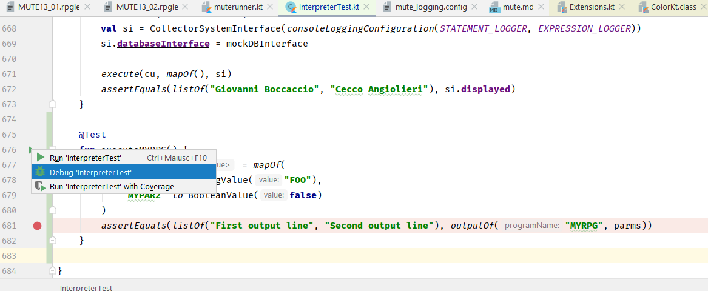

# Your first test for the Interpreter
So, you have just met our project, and you want to explore it using an unit test and a sample RPG program. Here is how you can do it.


- Create an .rpgle file (for example  _MYRPG.rpgle_) in the _smeup-rpg/rpgJavaInterpreter-core/src/test/resources_ directory. 
(You can use our [ftpas](https://github.com/smeup/smeup-rpg/blob/master/misc/ftpas.rb) utility to download a source member from AS400 via FTP, creating an UTF-8 file).
- You can add a test to the [InterpreterTest.kt](https://github.com/smeup/smeup-rpg/blob/master/rpgJavaInterpreter-core/src/test/kotlin/com/smeup/rpgparser/evaluation/InterpreterTest.kt) class, or you can copy it in a new one, deleting unused stuff.
- Your brand new test could be something like this:
```
@Test
    fun executeMYRPG() {
        val parms = mapOf(
            "MYPAR1" to StringValue("FOO"),
            "MYPAR2" to BooleanValue(false)
            )
        assertEquals(listOf("First output line", "Second output line"), outputOf("MYRPG", parms))
    }
```
- Now, after defining a breakpoint in your code, you're ready to debug your first test (see image below)



- If you feed the parser with a .rpgle file it can understand, a sensible point to put a breakpoint could be the method 
 _private fun execute(statement: Statement)_ of the [InternalInterpreter](https://github.com/smeup/smeup-rpg/blob/master/rpgJavaInterpreter-core/src/main/kotlin/com/smeup/rpgparser/interpreter/internal_interpreter.kt) class.
- Enjoy! :smiley: